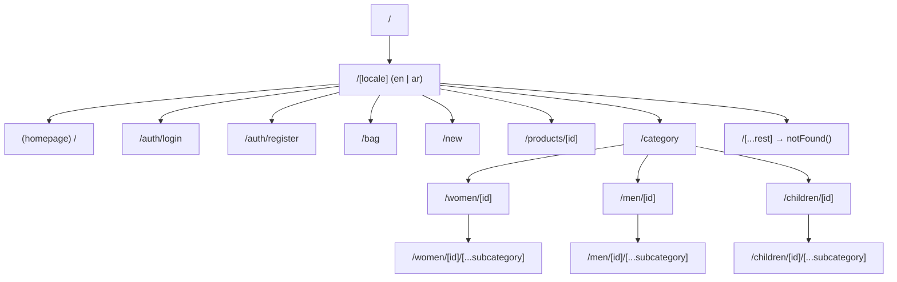
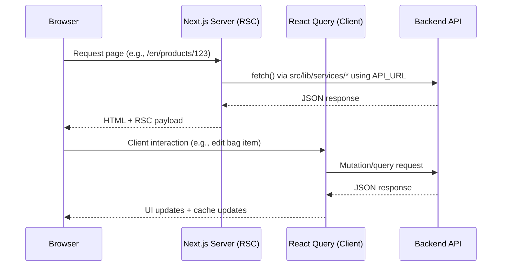
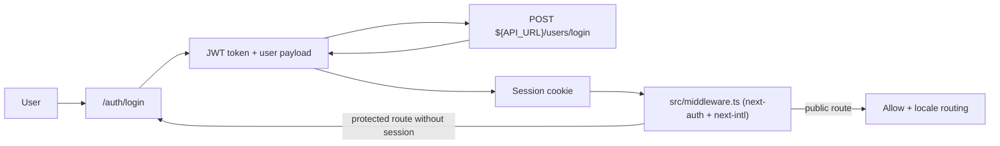

<div align="center">
  <h1>👗 Fashion E-Commerce Frontend</h1>
  <p>A modern, full-featured fashion store built with Next.js 14, TypeScript, and Tailwind CSS.</p>

  <p>
    <a href="https://fashion-e-commerce-frontend-pi.vercel.app" target="_blank">
      
    </a>
    
    
    
  </p>
</div>

---

## ✨ Features

- **Next.js 14 App Router**: Server Components by default with route handlers under `src/app/api/`.
- **Internationalization (i18n)**: `next-intl` with **`en` + `ar`** locales and RTL support (locale segment: `src/app/[locale]`).
- **Authentication**: `next-auth` (Credentials provider) with API login at `POST ${API_URL}/users/login`.
- **Product browsing**:
  - **Home** landing with hero, categories, best-selling, and new-arrivals sections.
  - **Product details** route `/:locale/products/[id]`.
  - **New arrivals** route `/:locale/new` (with `loading.tsx` and `error.tsx`).
  - **Category browsing** for `women`, `men`, `children` with optional nested subcategory catch-all.
- **Bag / cart**: `/:locale/bag` with item list, edit dialog, and order summary.
- **API integration**: server-side `fetch()` services in `src/lib/services/` (no Axios), with typed responses and `AppError` handling.
- **UI system**: Tailwind CSS + shadcn/ui (Radix primitives), `sonner` toasts, `next/image` remote patterns (Cloudinary/Gucci/local).
- **Stateful data**: TanStack React Query v5 provider for client interactions/mutations.

---

## 🛠 Tech Stack

| Category      | Technology                  | Purpose                                           |
| ------------- | --------------------------- | ------------------------------------------------- |
| Framework     | Next.js 14 (App Router)     | Routing, Server Components, API route handlers    |
| Language      | TypeScript (strict)         | Type safety across UI + API layer                 |
| Styling       | Tailwind CSS                | Utility-first styling                             |
| UI Components | shadcn/ui + Radix UI        | Accessible primitives and composable UI           |
| Data Fetching | TanStack React Query v5     | Client-side caching, mutations, and request state |
| Forms         | React Hook Form             | Form state management                             |
| Validation    | Zod + `@hookform/resolvers` | Schema validation and typed form fields           |
| Auth          | NextAuth.js v4              | Credentials auth + session handling               |
| i18n          | next-intl v4                | Locale routing, messages, formatting              |
| Notifications | Sonner                      | Toast notifications                               |
| Tooling       | ESLint + Prettier           | Linting/formatting consistency                    |

---

## 📁 Project Structure

Below is the actual structure (top-level highlights) taken from this repo (excluding `node_modules/`, `.next/`, `.git/`, and `yarn.lock`).

```text
fashion-ecommerce-frontend/
├─ .cursor/                       # Cursor rules that define project conventions
├─ .env                           # Local env (contains secrets — do not commit)
├─ .eslintrc.json                 # ESLint configuration
├─ .prettierrc                    # Prettier configuration
├─ next.config.mjs                # Next.js config (+ next-intl plugin, image remotePatterns)
├─ tailwind.config.ts             # Tailwind config (dark mode via class, shadcn tokens)
├─ public/                        # Static assets (images, icons)
└─ src/
   ├─ app/                        # Next.js App Router
   │  ├─ api/                     # Route handlers
   │  │  ├─ auth/[...nextauth]/   # NextAuth route handler
   │  │  └─ products/[productId]/ # Product API proxy route handler
   │  ├─ [locale]/                # Locale-aware routes (next-intl)
   │  │  ├─ (homepage)/           # Home page route group
   │  │  ├─ auth/                 # /login + /register
   │  │  ├─ bag/                  # Bag/cart page
   │  │  ├─ new/                  # New arrivals (+ loading/error)
   │  │  ├─ products/[id]/        # Product details page
   │  │  ├─ category/             # Category pages (women/men/children)
   │  │  └─ [...rest]/            # Catch-all → notFound()
   │  ├─ layout.tsx               # Root layout
   │  ├─ globals.css              # Global styles
   │  ├─ error.tsx                # Global error boundary
   │  ├─ global-error.tsx         # Global runtime error UI
   │  └─ not-found.tsx            # Global 404
   ├─ components/
   │  ├─ features/                # Feature-domain components (auth, bag, products, home, categories)
   │  ├─ layout/                  # App layout components (header/footer)
   │  ├─ providers/               # App-wide providers (React Query, NextAuth, NextIntl)
   │  ├─ skeletons/               # Skeleton loading components
   │  └─ ui/                      # shadcn/ui generated components (do not edit manually)
   ├─ hooks/                      # Custom hooks (feature/shared)
   ├─ i18n/                       # next-intl routing + request utilities
   └─ lib/
      ├─ actions/                 # Server actions (mutations)
      ├─ constants/               # Constants (headers, currency, API)
      ├─ schemes/                 # Zod schemas
      ├─ services/                # Server-side fetch wrappers (GET)
      ├─ types/                   # Shared TypeScript types
      └─ utils/                   # Shared utilities (errors, token helpers, query builders)
```

---

## 🚀 Getting Started

### Prerequisites

- Node.js 18+
- Yarn (v1)

### Installation

```bash
# 1. Clone the repo
git clone https://github.com/Shamsmedhat/fashion-e-commerce-frontend.git
cd fashion-ecommerce-frontend

# 2. Install dependencies
npm i -g yarn
yarn install

# 3. Set up environment variables
# This repo currently contains a .env (including secrets). Prefer using .env.local for local dev.
cp .env .env.local

# 4. Run the dev server
yarn dev
```

Open [http://localhost:3000](http://localhost:3000) to view it in the browser.

---

## ⚙️ Environment Variables

The project reads environment variables (server-side) for API and auth.

| Variable          | Description                                                              |
| ----------------- | ------------------------------------------------------------------------ |
| `API_URL`         | Backend API base URL (e.g. `http://localhost:3000/api/v1`)               |
| `NEXTAUTH_SECRET` | Secret used by NextAuth to sign/encrypt session data (`your_value_here`) |
| `NEXTAUTH_URL`    | Canonical app URL used by NextAuth (e.g. `http://localhost:3001`)        |

---

## 📜 Available Scripts

| Command      | Description              |
| ------------ | ------------------------ |
| `yarn dev`   | Start development server |
| `yarn build` | Build for production     |
| `yarn start` | Start production server  |
| `yarn lint`  | Run ESLint               |

---

## 🏗 Architecture Diagrams

### App Router Page Structure



### Data Fetching Flow



### Authentication Flow



---

## 🤝 Code Organization Guidelines

Every component and custom hook must follow this internal order:

1. **Translation** — `useTranslations()` / i18n logic
2. **Navigation** — router/pathname logic
3. **State** — `useState`, `useReducer`
4. **Context** — `useContext`
5. **Ref** — `useRef`
6. **Hooks** — custom hooks
7. **Queries** — `useQuery` (React Query)
8. **Mutation** — `useMutation` (React Query)
9. **Form** — `useForm` (React Hook Form + Zod)
10. **Variables** — derived constants
11. **Functions** — handlers and utilities
12. **Effects** — `useEffect` (always last)

---

## 🌍 Internationalization

- **Library**: `next-intl`
- **Locales**: `en`, `ar` (configured in `src/i18n/routing.ts`)
- **Routing**: locale segment is implemented as `src/app/[locale]/...`
- **RTL**: the locale layout sets `dir="rtl"` for Arabic and switches fonts accordingly (`src/app/[locale]/layout.tsx`)

---

## 📦 Backend

This frontend connects to a separate backend API (configured via `https://fashion-e-commerce-production.up.railway.app/api/v1`).

> 🔗 Backend repo: https://github.com/Shamsmedhat/fashion-e-commerce-backend
