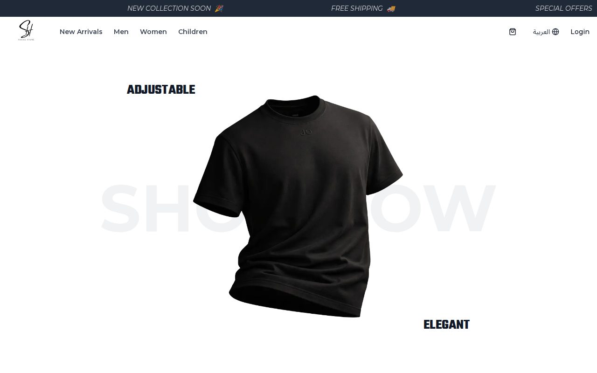
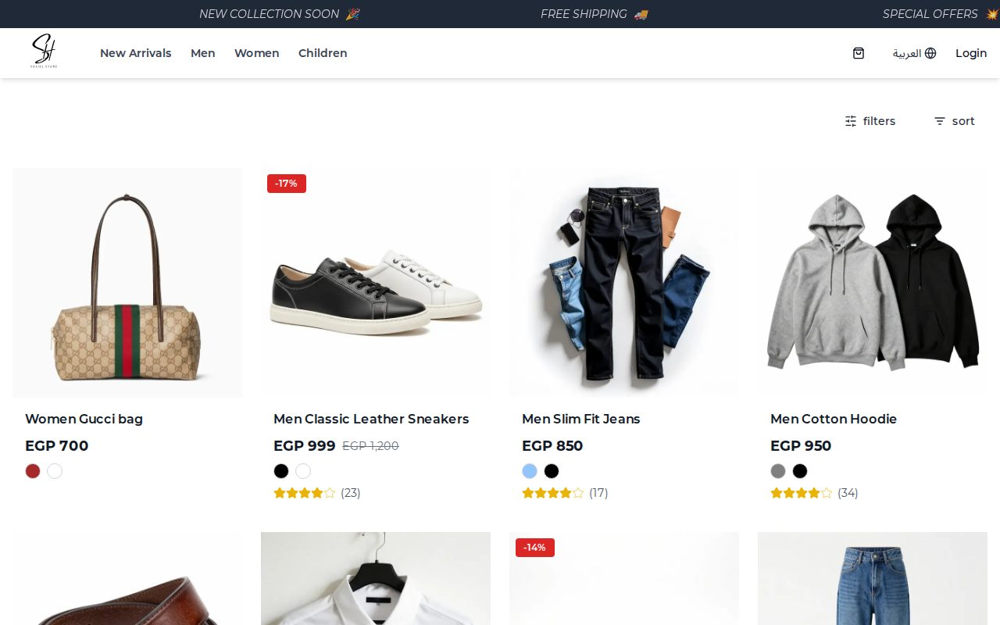
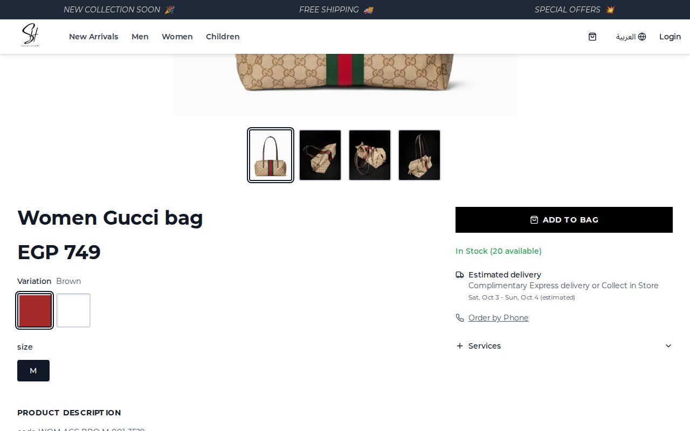
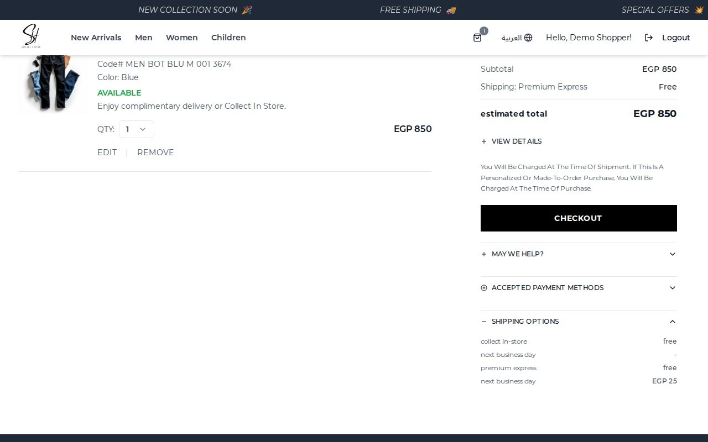
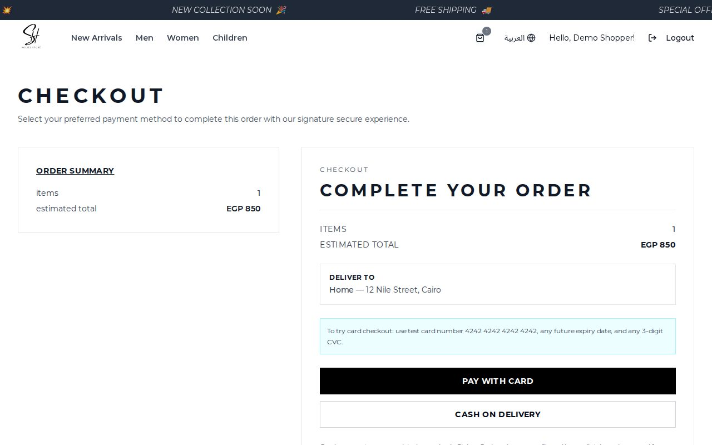
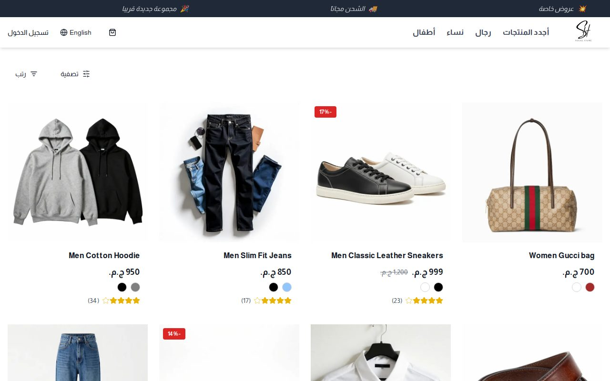
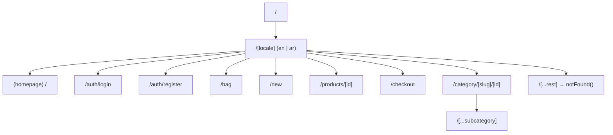
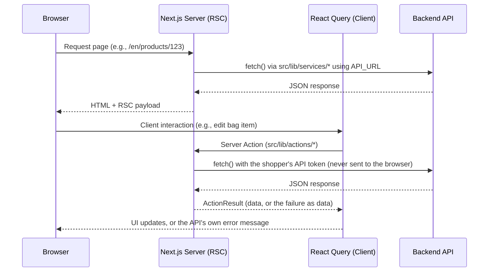
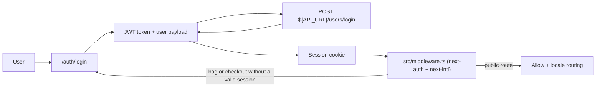

<div align="center">
  <h1>👗 Fashion E-Commerce Frontend</h1>
  <p>A modern, full-featured fashion store built with Next.js 14, TypeScript, and Tailwind CSS.</p>

  <p>
    <a href="https://fashion-e-commerce-frontend-pi.vercel.app" target="_blank">
      
    </a>
    
    
    
  </p>

  <p>
    <a href="https://github.com/Shamsmedhat/fashion-e-commerce-frontend/actions/workflows/ci.yml">
      
    </a>
  </p>
</div>

---

## ✨ Features

- **Next.js 14 App Router**: Server Components by default with route handlers under `src/app/api/`.
- **Internationalization (i18n)**: `next-intl` with **`en` + `ar`** locales and RTL support (locale segment: `src/app/[locale]`).
- **Authentication**: `next-auth` (Credentials provider) with API login at `POST ${API_URL}/users/login`. The session ends when the API token inside it expires.
- **Product browsing**:
  - **Home** landing with hero, categories, best-selling, and new-arrivals sections.
  - **Product details** route `/:locale/products/[id]`, with its own page title and a real 404 for unknown ids.
  - **New arrivals** route `/:locale/new` (with `loading.tsx` and `error.tsx`).
  - **Category browsing** on one dynamic route, `/:locale/category/[slug]/[id]`, with an optional subcategory. A main category created in the CMS gets a working page without a code change.
  - **Filter, sort and pagination** driven by the URL. A listing reads only the parameters it understands, so tracking parameters (`utm_source`, `fbclid`, …) never affect it.
- **Bag / cart**: `/:locale/bag` with item list, edit dialog, and an order summary that shows exactly what is charged.
- **Checkout**: `/:locale/checkout` with cash on delivery and Stripe card payments; a shopper without a saved address adds one there.
- **API integration**: server-side `fetch()` services in `src/lib/services/` (no Axios), with typed responses and `AppError` handling. Mutations are Server Actions that return failures as data, so the API's own message reaches the shopper in production builds.
- **CMS-driven cache**: product and category data is cached for weeks and refreshed on demand through `POST /api/revalidate`, which the admin dashboard calls after every edit.
- **UI system**: Tailwind CSS + shadcn/ui (Radix primitives), `sonner` toasts, `next/image` with Cloudinary as the only remote image host.
- **Stateful data**: TanStack React Query v5 provider for client interactions/mutations.
- **Tested**: Vitest unit tests for the pure logic, and Playwright end-to-end tests that run a production build against the real API on a seeded in-memory database.

---

## 📸 Screenshots

| Home                                    | Product listing (filter, sort, pagination)       |
| --------------------------------------- | ------------------------------------------------ |
|  |  |

| Product page                                  | Bag                              |
| --------------------------------------------- | -------------------------------- |
|  |  |

| Checkout                                   | Arabic (right-to-left)                             |
| ------------------------------------------ | -------------------------------------------------- |
|  |  |

---

## 🛠 Tech Stack

| Category      | Technology                  | Purpose                                           |
| ------------- | --------------------------- | ------------------------------------------------- |
| Framework     | Next.js 14 (App Router)     | Routing, Server Components, API route handlers    |
| Language      | TypeScript (strict)         | Type safety across UI + API layer                 |
| Styling       | Tailwind CSS                | Utility-first styling                             |
| UI Components | shadcn/ui + Radix UI        | Accessible primitives and composable UI           |
| Data Fetching | TanStack React Query v5     | Client-side caching, mutations, and request state |
| Forms         | React Hook Form             | Form state management                             |
| Validation    | Zod + `@hookform/resolvers` | Schema validation and typed form fields           |
| Auth          | NextAuth.js v4              | Credentials auth + session handling               |
| i18n          | next-intl v4                | Locale routing, messages, formatting              |
| Notifications | Sonner                      | Toast notifications                               |
| Tooling       | ESLint + Prettier           | Linting/formatting consistency                    |
| Testing       | Vitest + Playwright         | Unit tests and end-to-end tests                   |

---

## 📁 Project Structure

Below is the actual structure (top-level highlights) taken from this repo (excluding `node_modules/`, `.next/`, `.git/`, and `yarn.lock`).

```text
fashion-ecommerce-frontend/
├─ .env.example                   # The environment variables the app needs (copy to .env.local)
├─ .eslintrc.json                 # ESLint configuration
├─ .github/workflows/ci.yml       # Lint, type-check, unit tests and end-to-end tests
├─ docs/screenshots/              # Screenshots used in this README
├─ e2e/                           # Playwright end-to-end tests
├─ scripts/check-own-types.mjs    # Type-checks the project's own .d.ts files (see `yarn typecheck`)
├─ .prettierrc                    # Prettier configuration
├─ next.config.mjs                # Next.js config (+ next-intl plugin, image remotePatterns)
├─ tailwind.config.ts             # Tailwind config (dark mode via class, shadcn tokens)
├─ public/                        # Static assets (images, icons)
└─ src/
   ├─ app/                        # Next.js App Router
   │  ├─ api/                     # Route handlers
   │  │  ├─ auth/[...nextauth]/   # NextAuth route handler
   │  │  ├─ products/[productId]/ # Product API proxy route handler
   │  │  └─ revalidate/           # On-demand cache revalidation, called by the admin dashboard
   │  ├─ [locale]/                # Locale-aware routes (next-intl)
   │  │  ├─ (homepage)/           # Home page route group
   │  │  ├─ auth/                 # /login + /register
   │  │  ├─ bag/                  # Bag/cart page
   │  │  ├─ checkout/             # Checkout (+ success / cancel pages)
   │  │  ├─ new/                  # New arrivals (+ loading/error)
   │  │  ├─ products/[id]/        # Product details page
   │  │  ├─ category/[slug]/[id]/ # Category page (+ optional [...subcategory])
   │  │  ├─ error.tsx             # Error page inside the shop layout
   │  │  ├─ not-found.tsx         # 404 page inside the shop layout
   │  │  └─ [...rest]/            # Catch-all → notFound()
   │  ├─ layout.tsx               # Root layout
   │  ├─ globals.css              # Global styles
   │  ├─ error.tsx                # Error boundary outside the locale layout
   │  ├─ global-error.tsx         # Last-resort error UI
   │  └─ not-found.tsx            # 404 for paths outside the locale segment
   ├─ auth.ts                     # NextAuth configuration
   ├─ middleware.ts               # Locale routing + protection of the bag and checkout
   ├─ components/
   │  ├─ features/                # Feature-domain components (auth, bag, checkout, products, home, categories)
   │  ├─ layout/                  # App layout components (header/footer)
   │  ├─ providers/               # App-wide providers (React Query, NextAuth, NextIntl)
   │  ├─ skeletons/               # Skeleton loading components
   │  └─ ui/                      # shadcn/ui generated components (do not edit manually)
   ├─ hooks/                      # Custom hooks (feature/shared)
   ├─ i18n/                       # next-intl routing + request utilities
   └─ lib/
      ├─ actions/                 # Server actions (mutations)
      ├─ constants/               # Constants (headers, currency, API)
      ├─ schemes/                 # Zod schemas
      ├─ services/                # Server-side fetch wrappers (GET)
      ├─ types/                   # Shared TypeScript types
      └─ utils/                   # Shared utilities (errors, token helpers, query builders)
```

---

## 🚀 Getting Started

### Prerequisites

- Node.js 20+
- Yarn (v1)
- The [backend API](https://github.com/Shamsmedhat/fashion-e-commerce-backend) running locally. `yarn dev:memory` in that repo starts it on a throwaway, seeded in-memory database — no MongoDB or Cloudinary account needed.

### Installation

```bash
# 1. Clone the repo
git clone https://github.com/Shamsmedhat/fashion-e-commerce-frontend.git
cd fashion-e-commerce-frontend

# 2. Install dependencies
yarn install

# 3. Set up environment variables
cp .env.example .env.local

# 4. Run the dev server (the backend uses port 3000)
yarn dev -p 3001
```

Open [http://localhost:3001](http://localhost:3001) to view it in the browser.

---

## ⚙️ Environment Variables

The project reads environment variables (server-side only) for the API and auth. See `.env.example`.

| Variable          | Description                                                                                                    |
| ----------------- | -------------------------------------------------------------------------------------------------------------- |
| `API_URL`         | Backend API base URL, including `/api/v1` (e.g. `http://localhost:3000/api/v1`)                                |
| `NEXTAUTH_SECRET` | Secret used by NextAuth to sign/encrypt session data                                                           |
| `NEXTAUTH_URL`    | Canonical app URL used by NextAuth (e.g. `http://localhost:3001`)                                              |
| `CMS_ORIGIN`      | Optional. Dashboard origin(s) allowed to call `/api/revalidate`, comma-separated. Defaults to local + deployed |

---

## 📜 Available Scripts

| Command          | Description                                                     |
| ---------------- | --------------------------------------------------------------- |
| `yarn dev`       | Start development server                                        |
| `yarn build`     | Build for production                                            |
| `yarn start`     | Start production server                                         |
| `yarn lint`      | Run ESLint                                                      |
| `yarn typecheck` | Type-check the project, including its own `.d.ts` files         |
| `yarn test`      | Run the unit tests (Vitest)                                     |
| `yarn test:e2e`  | Run the end-to-end tests (Playwright; see [Testing](#-testing)) |

---

## 🗄 Caching

Catalogue data is fetched on the server and cached for a long time (30–75 days for products, a
year for categories), tagged `products`, `product-{id}`, `categories`, … It is refreshed on
demand rather than on a timer:

- the admin dashboard calls `POST /api/revalidate` with the admin's token after every edit;
- placing a cash order refreshes `products`, because it changes stock.

Known limitation: a **card** payment is confirmed by Stripe's webhook to the API, which has no
way to signal the storefront, so the stock number shown on a product page can lag behind until
the next edit or cash order. Stock is always re-checked by the API when adding to the bag and
when ordering, so nothing can be oversold.

---

## 🧪 Testing

**Unit tests** (`src/**/*.test.ts`) cover the logic that has no UI: listing parameters and
pagination, filtering and sorting, Server Action results, session expiry and route protection.

**End-to-end tests** (`e2e/`) drive a production build in a real browser: browsing, filtering and
paging, the 404 page, the Arabic shop, logging in, registering, adding to the bag, saving an
address, placing an order, and a CMS edit reaching the shop through cache revalidation. They run against the real API on a seeded in-memory database, so
they need the backend repo checked out next to this one:

```bash
# first time only
npx playwright install chromium

# builds the storefront, starts it and the API, and runs the suite
yarn test:e2e
```

Set `BACKEND_DIR` if the backend is somewhere other than `../fashion-ecommerce-backend`.
CI runs lint, the type-check, the unit tests and this suite on every push.

---

## 🏗 Architecture Diagrams

### App Router Page Structure


```mermaid
flowchart TD
  Root["/"] --> Locale["/[locale] (en | ar)"]

  Locale --> Home["(homepage) /"]
  Locale --> AuthLogin["/auth/login"]
  Locale --> AuthRegister["/auth/register"]
  Locale --> Bag["/bag"]
  Locale --> New["/new"]
  Locale --> ProductDetails["/products/[id]"]

  Locale --> Checkout["/checkout"]
  Locale --> Category["/category/[slug]/[id]"]
  Category --> SubCategory["/[...subcategory]"]

  Locale --> CatchAll["/[...rest] → notFound()"]
```

### Data Fetching Flow


```mermaid
sequenceDiagram
  participant Browser
  participant NextServer as Next.js Server (RSC)
  participant ReactQuery as React Query (Client)
  participant API as Backend API

  Browser->>NextServer: Request page (e.g., /en/products/123)
  NextServer->>API: fetch() via src/lib/services/* using API_URL
  API-->>NextServer: JSON response
  NextServer-->>Browser: HTML + RSC payload

  Browser->>ReactQuery: Client interaction (e.g., edit bag item)
  ReactQuery->>NextServer: Server Action (src/lib/actions/*)
  NextServer->>API: fetch() with the shopper's API token (never sent to the browser)
  API-->>NextServer: JSON response
  NextServer-->>ReactQuery: ActionResult (data, or the failure as data)
  ReactQuery-->>Browser: UI updates, or the API's own error message
```

### Authentication Flow


```mermaid
flowchart LR
  User --> LoginPage["/auth/login"]
  LoginPage --> NextAuth["NextAuth Credentials Provider"]
  NextAuth --> API["POST ${API_URL}/users/login"]
  API --> NextAuth["JWT token + user payload"]
  NextAuth --> Browser["Session cookie"]
  Browser --> Middleware["src/middleware.ts (next-auth + next-intl)"]
  Middleware -->|public route| PublicPage["Allow + locale routing"]
  Middleware -->|bag or checkout without a valid session| LoginPage
```

Only the bag and checkout are protected; every other URL is public, so an unknown one reaches
the 404 page. A session counts as valid only while the API token inside it has not expired.

---

## 🤝 Code Organization Guidelines

Every component and custom hook must follow this internal order:

1. **Translation** — `useTranslations()` / i18n logic
2. **Navigation** — router/pathname logic
3. **State** — `useState`, `useReducer`
4. **Context** — `useContext`
5. **Ref** — `useRef`
6. **Hooks** — custom hooks
7. **Queries** — `useQuery` (React Query)
8. **Mutation** — `useMutation` (React Query)
9. **Form** — `useForm` (React Hook Form + Zod)
10. **Variables** — derived constants
11. **Functions** — handlers and utilities
12. **Effects** — `useEffect` (always last)

---

## 🌍 Internationalization

- **Library**: `next-intl`
- **Locales**: `en`, `ar` (configured in `src/i18n/routing.ts`)
- **Routing**: locale segment is implemented as `src/app/[locale]/...`
- **RTL**: the locale layout sets `dir="rtl"` for Arabic and switches fonts accordingly (`src/app/[locale]/layout.tsx`)

---

## 📦 Related repositories

| Repo                                                                                      | Role                                |
| ----------------------------------------------------------------------------------------- | ----------------------------------- |
| [fashion-e-commerce-backend](https://github.com/Shamsmedhat/fashion-e-commerce-backend)   | Express + MongoDB API (Vercel)      |
| [fashion-ecommerce-dashboard](https://github.com/Shamsmedhat/fashion-ecommerce-dashboard) | Admin CMS (React + Vite, on Vercel) |

Production API: `https://fashion-ecommerce-backend-teal.vercel.app/api/v1`
